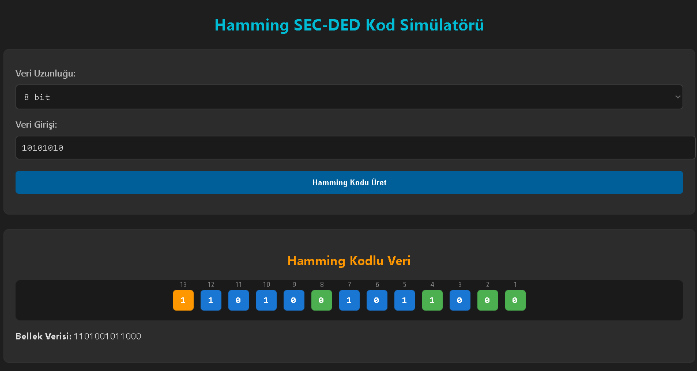

# Hamming SEC-DED Kod Simülatörü

Bu proje, Hamming SEC-DED (Single Error Correction - Double Error Detection) kodunu  simüle eden bir hesaplayıcıdır . 
Verideki hatalar manuel olarak yapılır, tek ve iki bitlik  hataları tespit edebilir ve  hatalar  düzeltebilir.
Bu projede 8,16,32 bitlik veriler girdi olarak kabul edilir . 
Hamming kodları, veri iletiminde karşılaşılan tek bitlik hataları düzeltmek ve çift bitlik hataları tespit etmek için kullanılan  hata düzeltme algoritmasıdır.

## Özellikler

- **Hamming Kodu Oluşturma**: Kullanıcı, veri bitlerini girerek Hamming kodunu oluşturabilir.
- **Hata Ekleme ve Tespit Etme**: İletilen veri üzerinde kullanıcı tarafından hatalar eklenebilir, ardından bu hatalar tespit edilebilir.
- **Hata Düzeltme**: Tek bitlik hatalar düzeltilebilir, çift bitlik hatalar tespit edilebilir.
- **Görsel Simülasyon**: Hata tespiti ve düzeltme süreçleri görsel olarak kullanıcıya sunulur.

## 8 Bit veri girişi

