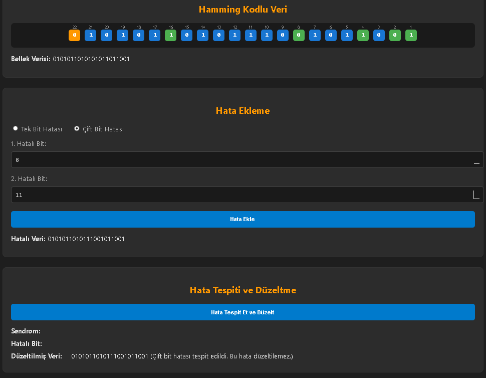

# Hamming SEC-DED Kod Simülatörü

Bu proje, Hamming SEC-DED (Single Error Correction - Double Error Detection) kodunu  simüle eden bir hesaplayıcıdır . 
Verideki hatalar manuel olarak yapılır, tek ve iki bitlik  hataları tespit edebilir ve  hatalar  düzeltebilir.
Bu projede 8,16,32 bitlik veriler girdi olarak kabul edilir . 
Hamming kodları, veri iletiminde karşılaşılan tek bitlik hataları düzeltmek ve çift bitlik hataları tespit etmek için kullanılan  hata düzeltme algoritmasıdır.

## Demo Erişim 
   [Buradan Erişebilirsiniz](https://miracbygl.github.io/hamming-code-simulator/)

## Demo Videosu 
 [Youtube](https://youtu.be/h1zDm1Y31qM?si=sei_VVBF1wqTC6-6)

## Özellikler

- **Hamming Kodu Oluşturma**: Kullanıcı, veri bitlerini girerek Hamming kodunu oluşturabilir.
- **Hata Ekleme ve Tespit Etme**: İletilen veri üzerinde kullanıcı tarafından hatalar eklenebilir, ardından bu hatalar tespit edilebilir.
- **Hata Düzeltme**: Tek bitlik hatalar düzeltilebilir, çift bitlik hatalar tespit edilebilir.
- **Görsel Simülasyon**: Hata tespiti ve düzeltme süreçleri görsel olarak kullanıcıya sunulur.

##  Veri Girişleri

## Tek Bit Manuel Hata Ekleme

## Çift Bitlik Manuel Hata Ekleme

## Tek Bit Hata Düzeltilmesi

## Çift Bit Hata Tespiti

## Teknolojiler

- **Dil**: JavaScript
- **Web Teknolojileri**: HTML, CSS
- **Algoritma**: Hamming SEC-DED (Single Error Correction - Double Error Detection)

